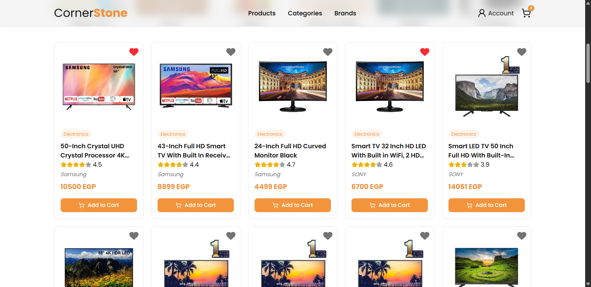

# Cornerstone E-Commerce Shop

A modern, fully responsive e-commerce web application built with Next.js and Tailwind CSS. This project was developed as the final project for the Route Academy Front-End Diploma, showcasing a complete online shopping experience.

## 🚀 Live Demo

Experience the clone live: [https://cornerstone-ecommerce-app.vercel.app/](https://cornerstone-ecommerce-app.vercel.app/)

## 📸 Screenshots

Here's a glimpse of the application's interface.

## ✨ Features

- **Modern & Responsive UI:** Beautifully designed with Tailwind CSS, ensuring a seamless experience on all devices (desktop, tablet, and mobile).
- **Product Catalog:** Browse a wide range of products, categorized for easy navigation. Discover new arrivals and top-selling items.
- **Detailed Product Pages:** View comprehensive product information, including multiple images, descriptions, and options to select quantities before adding to cart.
- **Filter Functionality:** Efficiently find desired products using a filtering.
- **Shopping Cart:** A sleek, intuitive shopping cart allows users to add, remove, and update item quantities, with a real-time subtotal display.
- **Wishlist:** Users can save their favorite items to a personal wishlist for future purchases.
- **User Authentication:** Secure sign-up and login functionality provides a personalized shopping experience.
- **Efficient State Management:** Using React Context API for global state.

## 🛠️ Technology Stack

This project is built using a modern and robust technology stack:

- **Frontend:**
  - [Next.js](https://nextjs.org/) - React framework for production.
  - [Tailwind CSS](https://tailwindcss.com/) - A utility-first CSS framework for rapid UI development.
  - [Shadcn UI](https://ui.shadcn.com/) - Reusable components built with Radix UI and Tailwind CSS.
  - [React Icons](https://react-icons.github.io/react-icons/) - SVG React icons of popular icon packs.
- **Backend & Database:**
  - [Route e-commerce API]
- **Deployment:**
  - [Vercel](https://vercel.com/) - Cloud platform for frontend developers, enabling instant deployments.

## 🎓 Credit and Acknowledgement

This project was developed as the final project for the Front-End Diploma at Route Academy. Special thanks to the instructors for their comprehensive guidance and support.

## 🔗 Connect with Me

- **GitHub:** [https://github.com/momen5406](https://github.com/momen5406)
- **LinkedIn:** [https://www.linkedin.com/in/momen5406/](https://www.linkedin.com/in/momen5406/)
- **Portfolio:** [https://momenhussein.vercel.app/](https://momenhussein.vercel.app/)
